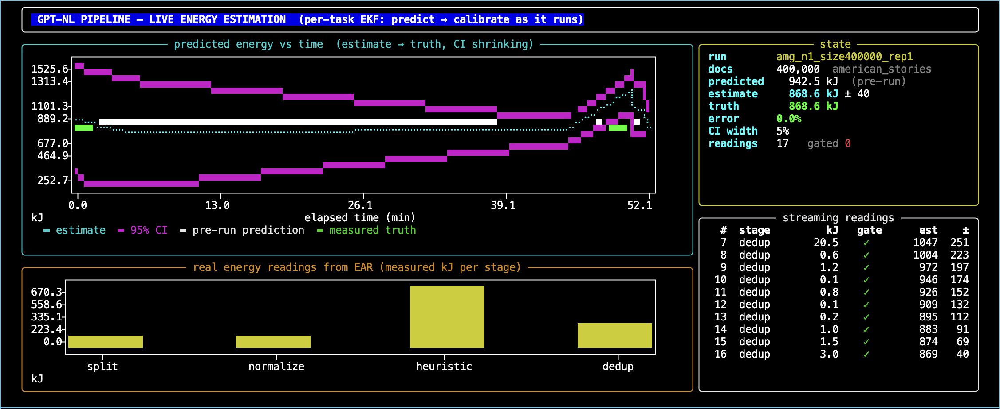

<div align="center">
<h1>⚡ GPT-NL Energy</h1>
<h3>Sample, Predict, Monitor — energy estimation for the GPT-NL data curation pipeline</h3>

[](https://python.org)
[](LICENSE)
[](https://huggingface.co/GPT-NL/gptnl-energy-models)

</div>

---

## The Problem

Before committing a multi-day data curation job for an LLM training corpus, the team needs **one number**: how much energy the whole pipeline will consume. The EAR energy meter can't run on production jobs, and shared HPC nodes contaminate readings with co-tenant workloads.

## The Solution

A **sample-then-predict** framework with live monitoring:

1. **Sample**: Run a few small calibration sizes on exclusive nodes (minutes, not hours)
2. **Calibrate**: Fit a two-parameter linear energy model per stage
3. **Predict**: One command → kWh, €, and kg CO₂ for the full production run
4. **Monitor**: Extended Kalman Filter converges the estimate in real time as telemetry arrives

```
┌──────────┐     ┌──────────────┐     ┌──────────────┐
│  Sample  │ ──▶ │  Calibrate   │ ──▶ │   Forecast   │
│  runs    │     │  E=c₀+c₁·n  │     │  kWh/€/CO₂   │
└──────────┘     └──────────────┘     └──────────────┘
                                             │
                                       ┌─────▼──────┐
                                       │   Monitor  │
                                       │  EKF live  │
                                       └────────────┘
```

## Real Numbers

Measured on the **Snellius supercomputer** (AMD Genoa nodes, 5-stage pipeline):

| Corpus | Docs | Chars/doc | Pipeline Energy | Cost (€0.30/kWh) | CO₂ |
|--------|------|-----------|-----------------|--------------------|-----|
| American Stories | 400k | 1,798 | 2.2 MJ (0.73 kWh) | €0.22 | 0.22 kg |
| GitHub Code | 400k | 3,151 | 3.8 MJ (1.27 kWh) | €0.38 | 0.38 kg |
| German PD | 100k | 48,881 | 16.5 MJ (5.50 kWh) | €1.65 | 1.65 kg |
| EU Parliament | 10k | 181,075 | 18.2 MJ (6.07 kWh) | €1.82 | 1.82 kg |

**Key finding**: Energy per *character* is stable at ~1.7×10⁻⁴ J/char across a 100× range in document length — making the predictor portable to unseen corpora.

## Quick Start

```bash
# Install
pip install gptnl-energy

# Download calibrated coefficients (from HuggingFace)
# Or calibrate from your own data:
gptnl-energy calibrate --data measurements.csv --output fits.json

# One-shot prediction
gptnl-energy forecast --n 400000
# →
#   Energy forecast — 400,000 docs | corpus=american_stories (~1,798 chars/doc)
#   ==================================================================
#     data_splitting               17.4 kJ    1.7 kJ      1%
#     string_normalization        175.2 kJ   29.0 kJ      8%
#     heuristic_filtering         624.8 kJ   97.7 kJ     28%
#     toxic_language_detection     60.8 kJ    5.9 kJ      3%
#     deduplication               124.6 kJ   17.7 kJ      6%
#   ------------------------------------------------------------------
#     TOTAL PIPELINE                1.00 MJ  104.6 kJ
#   ==================================================================
#     =    0.33 kWh   (PUE 1.2)
#     =  EUR 0.10     (@ EUR 0.30/kWh)
#     =   0.10 kg CO2  (@ 0.30 kg/kWh)

# Predict for a different corpus
gptnl-energy forecast --n 100000 --corpus cc_german_pd

# Use a different model
gptnl-energy forecast --n 400000 --model gbm

# Live monitoring dashboard (replay)
gptnl-energy monitor --run amg_n1_size400000_rep1
```

## Swappable Models

The tool ships with a model registry — swap models without changing code:

| Model | Type | Best For | Held-out MRE |
|-------|------|----------|--------------|
| `ols` (default) | Per-stage physics | Same-corpus prediction | ~10% |
| `ridge` | Regularized linear | Small data regimes | ~12% |
| `gbm` | Gradient boosting | Cross-corpus transfer | ~30-40% |
| `mlp` | Neural network | Complex interactions | ~50% |
| `ftt` | FT-Transformer | Size extrapolation | ~34% |
| `kalman-ftt` | Kalman-augmented FTT | Cold whole-run prediction | improves baseline |

```python
from gptnl_energy.models import get_model

# Physics model (default, no training needed)
m = get_model("ols")
m.load_fits("paper/data/ols_fits_with_dedup.json")
result = m.predict(n=400000, corpus="american_stories")
print(f"{result['total_j']/1e6:.2f} MJ")

# Swap to GBM
m = get_model("gbm")
m.fit(df)
result = m.predict(n=400000, corpus="cc_github_opencode")
```

```bash
# Replay a recorded run (starts the dashboard above)
gptnl-energy monitor --run amg_n16_size400000_rep1 --speed 0.5

# Test the estimator
gptnl-energy monitor --test --run amg_n1_size400000_rep1

# Show innovation gate rejecting contamination
gptnl-energy monitor --gate-demo --run amg_n1_size400000_rep1

# Monitor a LIVE Snellius job (SSH)
gptnl-energy monitor --live --run <current-run-slug>
```

## Live Monitor



The terminal dashboard shows the EKF estimate converging in real time. **Left chart**: total pipeline energy estimate (cyan) with shrinking 95% confidence band (magenta), starting from the pre-run model prediction (white) and converging toward the measured truth (green). **Right chart**: real energy readings from the EAR meter per pipeline stage. **Sidebar**: current estimate, error, gate rejections, and streaming task log.

## Methodology

### The Core Idea

Energy on an HPC node is `E = P × t` — power times time. But raw power readings on shared nodes are contaminated by co-tenant workloads. The key insight: **wall-clock time is co-tenancy invariant**, while power is inflated. So we:

1. Calibrate the time-per-document law on exclusive nodes (clean measurements)
2. Multiply by effective power `P_eff` (also calibrated once) to get energy
3. Use the Kalman filter during shared-node production runs to reject contaminated readings

### Layer 1 — Per-Stage Physics

Each pipeline stage follows a linear energy law:

$$E^{(s)} = c_0^{(s)} + c_1^{(s)} \cdot n$$

where $n$ is the number of documents. The intercept $c_0$ captures fixed overhead (SLURM startup, data loading). The slope $c_1$ captures per-document processing cost. Both are calibrated via ordinary least squares from 2–4 sample sizes on exclusive nodes (R² ≥ 0.997 in-sample).

The total pipeline energy is simply the sum:

$$E_{\text{pipeline}} = \sum_{s \in \text{stages}} \left(c_0^{(s)} + c_1^{(s)} \cdot n\right)$$

with a 95% prediction interval from the summed residual variance:

$$CI_{95} = 1.96 \cdot \sqrt{\sum_s \sigma^2_{(s)}}$$

### Layer 2 — Cross-Corpus Transfer

The per-document coefficient $c_1$ varies wildly between corpora — a German parliamentary document is 100× longer than an American news story, so per-document energy scales accordingly. But the **per-character** coefficient is nearly invariant:

$$k^{(s)} = \frac{c_1^{(s)}}{\text{chars\_per\_doc}} \approx \text{constant}$$

Measured across 4 corpora spanning a 100× range in document length, $k$ has a coefficient of variation below 30%. This means for an unseen corpus, we predict:

$$c_1^{\text{(unseen)}} = k_{\text{avg}} \cdot \text{chars\_per\_doc}_{\text{unseen}}$$

The learned model $g$ improves on this by predicting $k$ from data-derived features — compute intensity (CPI, GFLOPS), I/O rate, and the survival rate after quality filtering — enabling cold prediction without any calibration runs on the target corpus.

### Layer 3 — Extended Kalman Filter

The EKF treats each pipeline stage's energy as a state variable. The prior is the model prediction. As each parallel task completes and reports its measured energy from the EAR meter, the filter recursively blends the prior with the data.

**State vector**: $\mathbf{x} = [E^{(1)}, E^{(2)}, ..., E^{(S)}]$ — one energy per stage

**Prior**: $\hat{\mathbf{x}}_0$ from the calibrated model, with initial covariance $\mathbf{P}_0 = (0.45 \cdot \hat{\mathbf{x}}_0)^2 \mathbf{I}$

**Update** — when task $k$ of stage $s$ reports energy $z_k$:

$$\hat{E}^{(s)}_k = w_k \cdot \left(z_k \cdot \frac{M_s}{k}\right) + (1 - w_k) \cdot \hat{E}^{(s)}_0$$

where $w_k = \frac{k}{k + k_0}$ is the blending weight, $M_s$ is the total number of tasks in stage $s$, and $k_0 = 2$ controls how quickly we trust the data over the prior. The variance shrinks as more tasks report:

$$\text{Var}(\hat{E}^{(s)}_k) = (1 - w_k)^2 \cdot P_0^{(s)} + \sigma^2_{\text{sample}} \cdot (M_s - k)$$

**Innovation Gate** — a reading is rejected if a single task's energy exceeds the **entire stage's predicted energy** by a factor of gate_ratio (default 2.5×). This catches shared-node contamination where co-tenant workloads inflate a node's power reading without affecting wall-clock time:

$$\text{reject if } \frac{z_k}{\hat{E}^{(s)}_0} > \gamma_{\text{gate}}$$

Rejected readings are replaced with the prior's per-task share: $z_k \leftarrow \hat{E}^{(s)}_0 / M_s$.

### Gate Performance

| Scenario | Without Gate | With Gate |
|----------|-------------|-----------|
| Clean run (exclusive node) | 8.3% error | 8.3% error (no false rejects) |
| Contaminated (shared node, 2.4× inflation) | +93% error | +8% error |

### Validation: Leave-One-Corpus-Out

The honest test for cold prediction: train on N−1 corpora, predict the held-out corpus's whole-run total. No data leakage — the test corpus contributes only its `chars_per_doc` value.

| Model | Median MRE (energy) | Median MRE (time) |
|-------|--------------------|--------------------|
| Per-char baseline (mean k) | 47% | 60% |
| GBM (learned g) | 31% | 34% |
| FT-Transformer | 308% | — |

The baseline is physics (2 parameters per stage). GBM improves it. The transformer overfits catastrophically with only 4 corpora — a honest negative result that will improve with the upcoming 16-corpus sweep.

## Integration with GPT-NL Pipeline

This package is designed to integrate directly with the [GPT-NL data curation pipeline](https://github.com/GPT-NL/data-curation-pipeline):

```bash
# In the pipeline's pyproject.toml:
# gptnl-energy = "^0.1.0"

# Before launching a curation run:
poetry run gptnl-energy forecast --n 1400000 --corpus cc_german_pd

# During the run, monitor energy:
poetry run gptnl-energy monitor --live --run <slug>
```

## Repository Structure

```
gptnl-energy/
├── src/gptnl_energy/
│   ├── __init__.py          # Package entry
│   ├── data.py              # Data loading, corpus parsing, config
│   ├── forecast.py          # Pre-run energy prediction
│   ├── ekf.py               # Extended Kalman Filter estimator
│   ├── monitor.py           # Live terminal dashboard
│   ├── models/
│   │   ├── __init__.py      # Model registry + sklearn models
│   │   └── torch_models.py  # FT-Transformer (PyTorch)
│   └── cli/
│       └── main.py          # Click CLI (forecast, monitor, calibrate)
├── scripts/
│   ├── train_all.py         # Train all models
│   └── upload_to_hf.py      # Upload models to HuggingFace
├── paper/                   # Thesis + data + fitted coefficients
│   ├── data/
│   │   ├── measurements_generalized.csv
│   │   ├── measurements_raw_generalized.csv
│   │   └── ols_fits_with_dedup.json
│   └── thesis.pdf
└── models/                  # Trained model artifacts
```

## Citation

```bibtex
@mastersthesis{malik2026energy,
  title={Complexity-Aware Energy Estimation for an LLM Data Curation Pipeline},
  author={Malik, Romir},
  school={Utrecht University},
  year={2026},
  type={MSc Thesis}
}
```

## License

Apache 2.0 — see [LICENSE](LICENSE).

---

Built by [Romir Malik](https://github.com/kruuusher13) · MSc Applied Data Science · Utrecht University · Thesis deadline: July 2026
